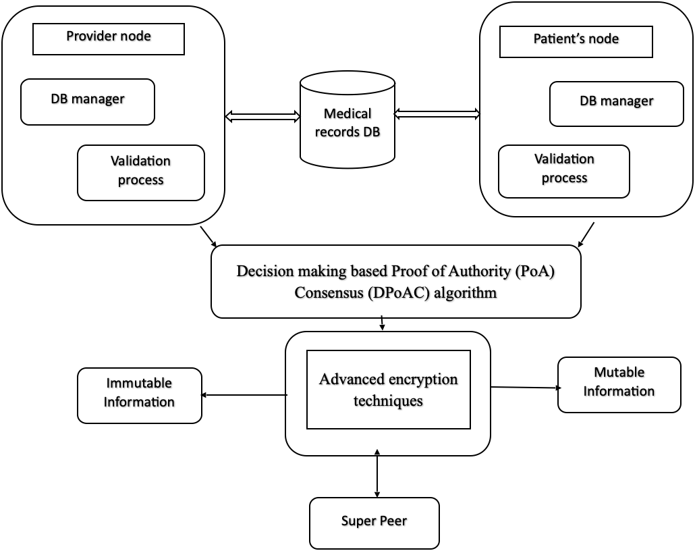
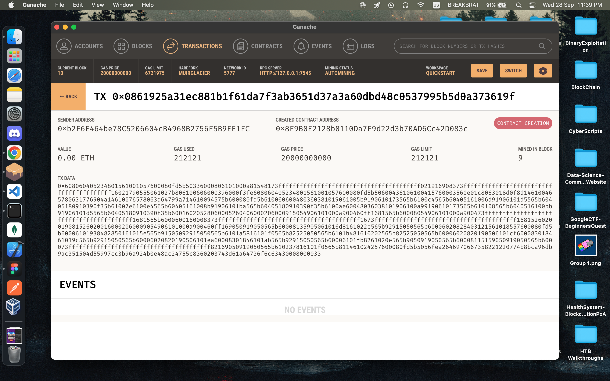
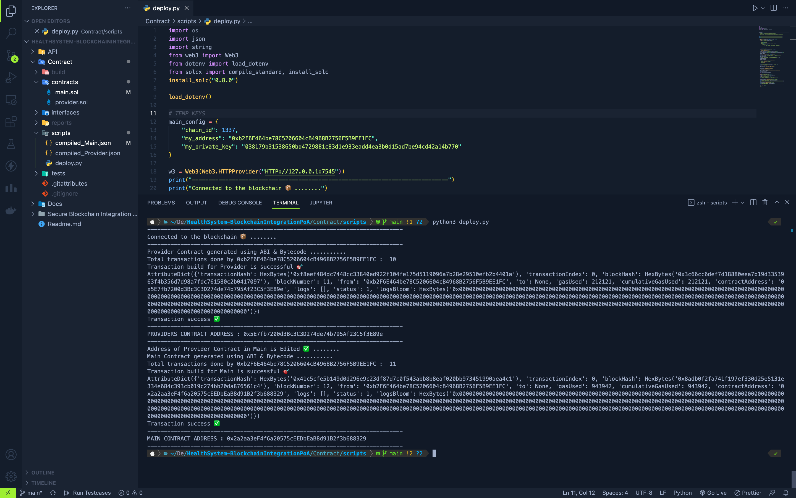
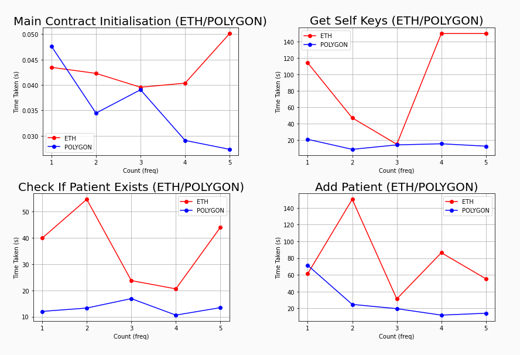
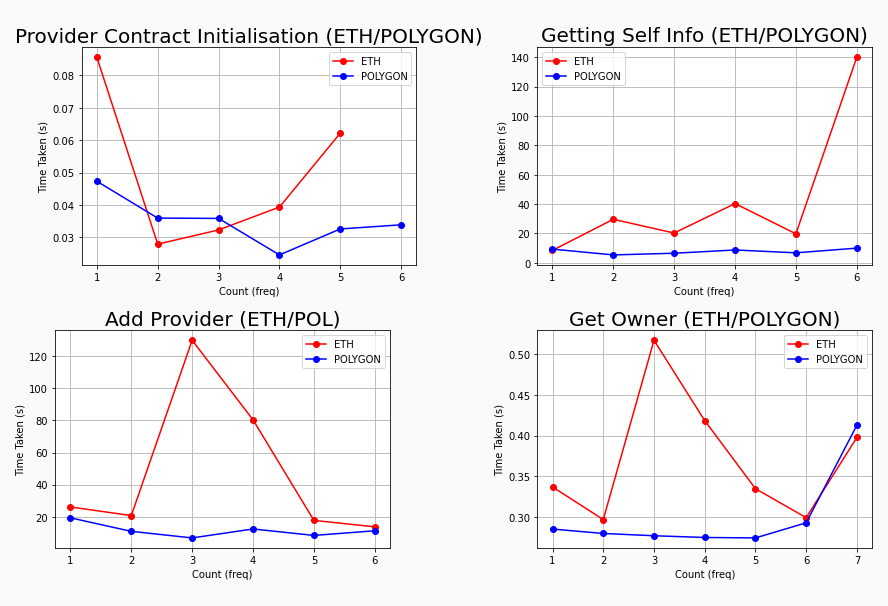
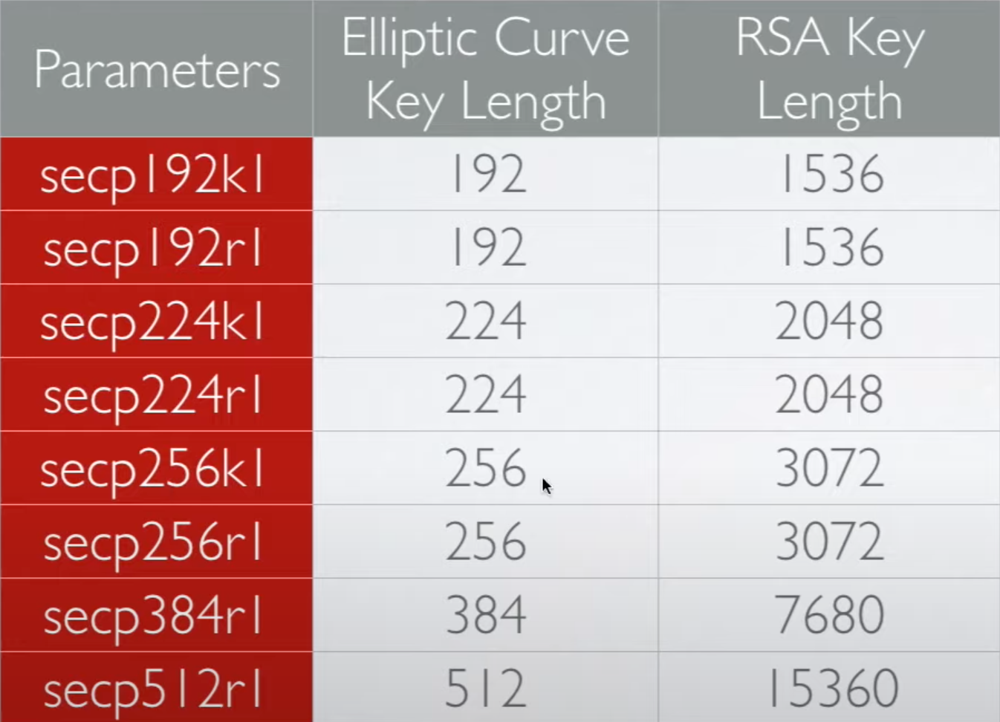
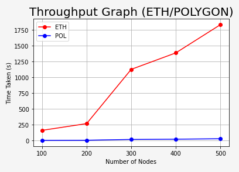

# Secure Blockchain Integration (Healthcare Systems)

Faculty : Ms. Sowmiya B

**E-Healthcare system in cloud computing using blockchain and medchain technology to protect user data.**

### System Architecture

- Our system will store all the patients data on the Cloud Network.
- There will be different nodes:
  - Patient’s Node
  - Provider’s Node
- There will be a key associated with every medical record, If we want to share the patient’s data then patient needs to share the key to access the medical records.
- The data stored in cloud is encrypted using asymmetric keys.

```
Cloud Structure : To store the data of the patients.
|
API : Acts as a Bridge for the data transfer
|
Blockchain : To create a safe access to the EMR using keys.
|
Nodes : To fetch the data from the Blockchain.
```

### Creating an Architecture

- Blockchain Smart Contracts
- Cloud Integrations

**Proposed Architecture for the System**

<p align="center">
</img>
</p>

**OUR ARCHITECTURE & DATA FLOW with entities 👷🚀**

<p align="center">
</img>
</p>

### Contracts :

Main.sol : It is a contract that acts as a bridge for the Provider Node and the Patient Node.

Provider.sol : It only keeps the record for Providers on the network as some features are only limited to the Provider in our main smart contract.

## Deployment :

### Contracts :

The deployment is being done on the Ganache Network for testing purposes and we are using python scripts to generate the compiled code for our solidity contract in order to get the ABI and the byte code to further access the functions of the Contract in a python script.

- Web3 : used to connect to the ganache interface
- solcx : To compile the contract

**Ganache Board :**

</img>

**Compilation Output :**

</img>

From here we can observe that our contract has no errors or so we will now deploy our contract on two different networks.

- Polygon Mumbai Testnet
- Ethereum Goerli Testnet

### We will use Remix IDE to deploy the contracts to the Test nets

**POLYGON**

---

- Provider.sol → `0x924bDF9655e84a65Cb9Af6431Ac9E7Eb04A550f8`
- Main.sol → `0x19f10b2E9E1fC1D57Af3F489Fb78A5463b6ffF82`

**GOERLI**

---

- Provider.sol → `0x908131D2ED45370ba51c578b9E2003f37b82E13b`
- Main.sol → `0xC9de7bbE283D5D11614d3450c2f583bfBE3c4aaB`

Contracts Deployed ✅ on Blockchain (Polygon Mumbai & Ethereum Goerli) 📦

### Graphs (Latency)

**MAIN FUNCTION GRAPHS (ETHEREUM/POLYGON)**
</img>

**PROVIDER FUNCTION GRAPHS (ETHEREUM/POLYGON)**
</img>

## Encryption

Here we will be using Eliptical Curve Cryptography Algorithm for generating the public/private key pair.

**ECC Comparision Table**

This is a comparision table demonstrating the size of the **RSA Key vs ECC Key** in order to achieve the same security level.

</img>

Here we will be using **"secp256k1 ECC Key"** which will be 256 bit Key with the same security level of the **"3072 bit RSA Key"**

## Nodes Testing

We are going to test the resource, throughput and latency with respect to the number of nodes in the whole network. We are going to test the whole network using **Brownie**. We are going to generate huge number of accounts using brownie.

```sh
ganache-cli --accounts <NumberOfAccounts> --hardfork istanbul --gasLimit 12000000 --mnemonic brownie --port 8545
```

OUTPUT

```sh
Ganache CLI v6.12.2 (ganache-core: 2.13.2)

Available Accounts
==================
(0) 0x66aB6D9362d4F35596279692F0251Db635165871 (100 ETH)
(1) 0x33A4622B82D4c04a53e170c638B944ce27cffce3 (100 ETH)
(2) 0x0063046686E46Dc6F15918b61AE2B121458534a5 (100 ETH)
(3) 0x21b42413bA931038f35e7A5224FaDb065d297Ba3 (100 ETH)
(4) 0x46C0a5326E643E4f71D3149d50B48216e174Ae84 (100 ETH)
(5) 0x807c47A89F720fe4Ee9b8343c286Fc886f43191b (100 ETH)
(6) 0x844ec86426F076647A5362706a04570A5965473B (100 ETH)
(7) 0x23BB2Bb6c340D4C91cAa478EdF6593fC5c4a6d4B (100 ETH)
(8) 0xA868bC7c1AF08B8831795FAC946025557369F69C (100 ETH)
(9) 0x1CEE82EEd89Bd5Be5bf2507a92a755dcF1D8e8dc (100 ETH)
(10) 0x5C04f1b36C6e90Bf649914021De6b743652e3881 (100 ETH)
.......
.......
.......
HD Wallet
==================
Mnemonic:      brownie
Base HD Path:  m/44'/60'/0'/0/{account_index}

Gas Price
==================
20000000000

Gas Limit
==================
12000000

Call Gas Limit
==================
9007199254740991
```

### Publishing the contract on Brownie locally

Edit the config in the main code as follows :

```py
main_config = {
    "chain_id": 1337,
    "my_address": "account[0]",
    "my_private_key": "privateKey[0]"
}
```

```sh
cd Contract/scripts
python3 deploy.py
```

**OUTPUT**

```sh
-----------------------------------------------------------------------------
Connected to the blockchain 📦 ........
-----------------------------------------------------------------------------
Provider Contract generated using ABI & Bytecode ...........
Total transactions done by 0x66aB6D9362d4F35596279692F0251Db635165871 :  0
Transaction build for Provider is successful 🎯
AttributeDict({'transactionHash': HexBytes('0xb6a7d48d2946d5610e2c3c0608207e05079eacdd02500e84551d3fe3f5e15bc7'), 'transactionIndex': 0, 'blockHash': HexBytes('0x5fd05df02b2d307b2a1607311aba2219d3b7b9e1f4e5e9a5508ef4561945612e'), 'blockNumber': 1, 'from': '0x66aB6D9362d4F35596279692F0251Db635165871', 'to': None, 'gasUsed': 350267, 'cumulativeGasUsed': 350267, 'contractAddress': '0x3194cBDC3dbcd3E11a07892e7bA5c3394048Cc87', 'logs': [], 'status': 1, 'logsBloom': HexBytes('0x00000000000000000000000000000000000000000000000000000000000000000000000000000000000000000000000000000000000000000000000000000000000000000000000000000000000000000000000000000000000000000000000000000000000000000000000000000000000000000000000000000000000000000000000000000000000000000000000000000000000000000000000000000000000000000000000000000000000000000000000000000000000000000000000000000000000000000000000000000000000000000000000000000000000000000000000000000000000000000000000000000000000000000000000000000000')})
Transaction success ✅
-----------------------------------------------------------------------------
PROVIDERS CONTRACT ADDRESS : 0x3194cBDC3dbcd3E11a07892e7bA5c3394048Cc87
-----------------------------------------------------------------------------
Address of Provider Contract in Main is Edited ✅ ........
Main Contract generated using ABI & Bytecode ...........
Total transactions done by 0x66aB6D9362d4F35596279692F0251Db635165871 :  1
Transaction build for Main is successful 🎯
AttributeDict({'transactionHash': HexBytes('0xf266c8b3bcc2a57a5211ccc4a81c3f6ced51ca2fcfa9122b41a4cfb881538363'), 'transactionIndex': 0, 'blockHash': HexBytes('0x6cca8ff1d44eb331ddc3d71586d6df8846bddb34930a62869085f5b668ae089f'), 'blockNumber': 2, 'from': '0x66aB6D9362d4F35596279692F0251Db635165871', 'to': None, 'gasUsed': 978955, 'cumulativeGasUsed': 978955, 'contractAddress': '0x602C71e4DAC47a042Ee7f46E0aee17F94A3bA0B6', 'logs': [], 'status': 1, 'logsBloom': HexBytes('0x00000000000000000000000000000000000000000000000000000000000000000000000000000000000000000000000000000000000000000000000000000000000000000000000000000000000000000000000000000000000000000000000000000000000000000000000000000000000000000000000000000000000000000000000000000000000000000000000000000000000000000000000000000000000000000000000000000000000000000000000000000000000000000000000000000000000000000000000000000000000000000000000000000000000000000000000000000000000000000000000000000000000000000000000000000000')})
Transaction success ✅
-----------------------------------------------------------------------------
MAIN CONTRACT ADDRESS : 0x602C71e4DAC47a042Ee7f46E0aee17F94A3bA0B6
-----------------------------------------------------------------------------
```

Now we will generate a script to add the patients as a node in the blockchain network in interval and then access the function of getting the self keys after adding the patients as 100->200->300->400->500 and we will record the timing of the throughput and taking that data to plot the graph for the throughput.

Now the values we are getting are the estimate values because of the testing done locally on the system with ganache-cli by running a local nodes. For example the output of 500 nodes is :

```
All 500 Address Added ✅
Your Key [0x66aB6D9362d4F35596279692F0251Db635165871] :
(0, ('54j6j65jwwkil65343wewekjbfwe347629734623974239ehr23uhf2fb', True), True)
total time taken :  4.572136402130127 seconds
```

But we all know that these are not the real values, So we will use a formula to plot the values for the graph so that we can understand the proper working of the smart contract using the speculated values.

```
FORMULA
-------

Plot Value = ( Average Value of Ganache / Average value of Network Values )^-1 * Average Value of Ganache
```

### Throughput Graph

</img>

Hence the graphs verify our prediction that polygon is better for using on blockchain systems rather than ethereum due to the follwing reasons :
- less throughput
- less interaction time
- low resource utilisation
- low gas fees
